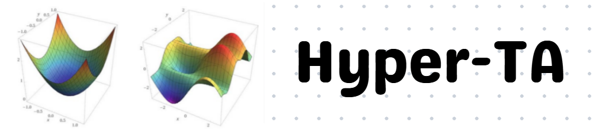
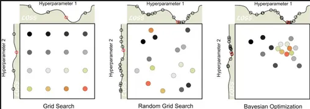
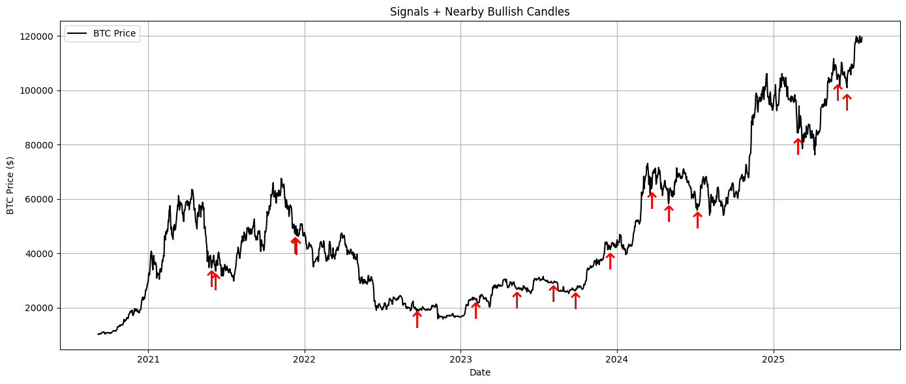

<div align="center">

# HyperTA

A Complete Technical Analysis Toolkit, Signal Generator & Hyperparameter Optimization Framework.

<br/>



</div>

[](https://www.python.org/)
[](https://opensource.org/licenses/MIT)
[](https://github.com/astral-sh/ruff)

<br/>

Accompanying Paper & Full Docs (soon)

---

## Overview

HyperTA is a technical analysis optimization framework that autonomously explores the parameter space of one or more indicators — or combinations of their signals — to find configurations that maximize a user-defined objective. Indicators, performance metrics, and threshold trigger rules are all user-definable (with multiple prebuilt options included). Rather than relying on conventional defaults (like RSI period=14), HyperTA treats strategy parameterization as a search problem and solves it systematically, returning the optimal configuration alongside full diagnostics.

Built for **quantitative researchers**, **algorithmic traders**, and **strategy developers**.

This library uses the [uv](https://github.com/astral-sh/uv) package manager.

---

## Technical Indicators

HyperTA ships ~15 prebuilt technical indicators (and you can add your own):

- RSI, StochRSI, ROC, Williams %R, ADX, MACD, MA, EMA, EMA Ribbon, EMA Crossover, Ichimoku Cloud, Bollinger Bands, ATR, Donchian Channels

---

## Threshold Detection Logic

Supported signal threshold mechanisms (custom rules welcome):

1. **`crossLevel`** — indicator crosses a fixed numeric level
2. **`crossLines`** — fast vs slow line crossover (e.g. MACD / EMA)
3. **`inRange`** — indicator enters a numeric band
4. **`holdLevel`** — stays above/below a level for N candles
5. **`stdvBandsThreshold`** — EMA ± σ band breaches
6. Plus skew / kurtosis / derivative-based rules

---

## Search Algorithms

1. **Grid Search** — exhaustive exploration of all parameter combinations
2. **Random Search** — random sampling (better for large spaces)
3. **Bayesian Optimization** — probabilistic guided search
4. More to be added...

---

## Hyperparameter Optimization

You can optimize **one** indicator + threshold, or **many** indicators / thresholds and their combinations.

### Single indicator + threshold

Example: find the best RSI `period` for a given series under `crossLevel`, optimizing a metric such as return over a search range like `[2, 100]`.

### Multi-dimensional search spaces

Define multiple search spaces with different indicators, thresholds, metrics, and combination modes to explore higher-dimensional relationships.

```python
search_config = {
    "type": "crossLevel",
    "indicator": "rsi",
    "period": [7, 14, 21],
    "threshold": [25, 30, 35],
}
# Total combinations grow fast — prefer Random or Bayesian for large configs
```



---

## Signal Composition: `mixThresholds()`

Composite signal generation via set logic:

- **`or`** (union) — any indicator triggers
- **`and`** (intersection) — all indicators must trigger

```python
strategy = mixThresholds(price, [search_config[0], search_config[1]], search="bayesian", mode="and")
```



---

## Architecture

```
HyperTA/
├── Indicators/       # calculateRsi, calculateMacd, …
├── Thresholds/       # crossLevel, inRange, mixThresholds, …
├── Search/           # grid / random / bayesian search
├── Structures/       # swings, fib, S/R, channels, Wyckoff, …
├── Plots/            # plotChart, plotIndicator, plotSignals, plotStructure
├── Metrics/          # entropy, derivatives, summary stats
├── Providers/        # yfinance fetch
├── Reporting/        # PDF report builders
├── Statistical/      # statistical helpers
├── Filtering/        # signal filters
├── Strategies/       # strategy stubs
├── ML/               # optimizers / ML hooks
└── Utils/            # shared utilities
Configs/              # search space configs
Assets/               # docs + images
main.py               # demos
cli.py                # Typer CLI
```

---

## Tech Stack

**Core:** `numpy`, `pandas`, `matplotlib`, `plotly`, `yfinance`, `finta`, `optuna`, `scipy`, `joblib`, `typer`, and more.

---

## CLI

```bash
uv run python cli.py --help
```

Commands include: `docs`, `guide`, `test`, `health`, `version`, `fetch`, `list-functions`, `list-thresholds`, `list-strategies`.

---

## Use Cases

- Quantitative strategy research
- Signal generation & validation
- Multi-indicator hyperparameter optimization
- Trading system prototyping
- Market structure / regime exploration
- ML feature engineering from TA signals

---

## Quick Start

Install uv (if needed):

```bash
curl -LsSf https://astral.sh/uv/install.sh | sh
```

Clone and run:

```bash
git clone https://github.com/MwkosP/Hyper-TA.git
cd Hyper-TA
uv sync
uv run python main.py
```

---

## License

MIT License.

---

## Contributing

Contributions welcome — open an issue or submit a PR.

---

## Disclaimer

This software is for **research and educational purposes only**. It is not financial advice. Trading involves substantial risk of loss. Always do your own research and consult with a qualified financial advisor before making investment decisions.
